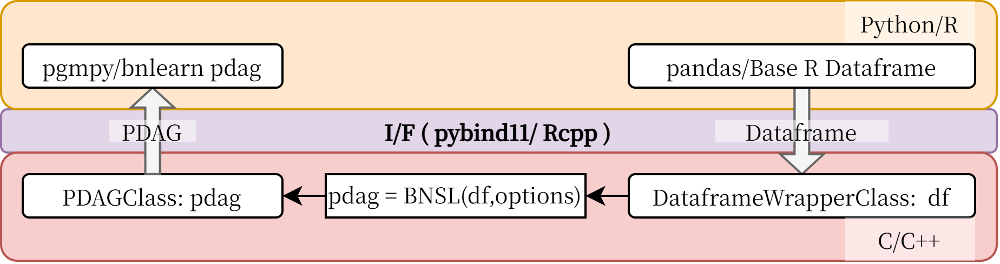

We are happy to accept contributions to the project in the form of pull requests.

# Issues
Please feel free to create a new issue for any bugs, questions etc. 
It is very helpful if you gives us enough information to reproduce the problem. 
Github's guide on [about issues](https://guides.github.com/features/issues/) is also useful.

--- 
# Pull Requests
1. Fork the repository
2. Create a new branch from the `develop` branch
3. Make your changes
4. Push your changes to your fork
5. Create a pull request

---
# Scripts
```bash
pytest # run pytest
./build_gtest.sh # build gtest
./run_gtest.sh # run gtest
./format.sh # format the code before submitting a pull request
./gen_docs.sh # if you want to check the documentation locally
```

---
# Branches
Branch naming examples:
- `master` - The main branch. This branch is always stable and contains the latest release.
- `develop` - The development branch. This branch contains the latest changes and is where new features are developed.
- `feature/*` - Feature branches. These branches are created from `develop` and are used to develop new features.

---
# Coding Style
For C++ code, we use clang-format with Google's C++ style guide [Google C++ Style Guide](https://google.github.io/styleguide/cppguide.html).
Before submitting a pull request, please run the following command to format your code:
```bash
./scripts/format.sh
```
| **Element** | **Naming Rule** | **Example** |
| --- | --- | --- |
| **File Name** | snake_case | `my_file.h`, `my_file.cpp` |
| **Directory Name** | snake_case | `src/`, `include/`, `test_utils/` |
| **Class** | PascalCase | `MyClass`, `MyStruct` |
| **Function** | snake_case | `my_function()` |
| **Variable** | snake_case | `my_variable` |
| **Constant** | UPPERCASE_SNAKE_CASE | `MY_CONSTANT` |
| **Namespace** | snake_case | `my_namespace` | `my_namespace::my_function()` |

---
# Data exchange between Python/R and C/C++

| C++                           | Python (pybind11)             | R (Rcpp)                      |
|-------------------------------|-------------------------------|-------------------------------|
| bool                          | bool                          | ????                          |
| int                           | int                           | ????                          |
| unsigned int                  | int                           | ????                          |
| long                          | int                           | ????                          |
| unsigned long                 | int                           | ????                          |
| float                         | float                         | ????                          |
| double                        | float                         | ????                          |
| std::string                   | str                           | ????                          |
| std::pair<T1, T2>             | tuple                         | ????                          |
| std::tuple<T...>              | tuple                         | ????                          |
| std::vector<T>                | list                          | ????                          |
| std::array<T, N>              | list                          | ????                          |
| std::map<K, V>                | dict                          | ????                          |
| std::unordered_map<K, V>      | dict                          | ????                          |
| std::set<T>                   | set                           | ????                          |
| std::function<T1, T2>         | Python callable               | ????                          |


---
# Interface of BNSL algorithm



The BNSL algorithm requires a `DataframeWrapper` class object as its first argument.  
The `DataframeWrapper` class provides the following interface:
``` C++
class DataframeWrapper {
  DataframeWrapper(const py::object& dataframe); // Constructor from a Python dataframe
  // TODO: Constructor from an base R dataframe 
  // Other member functions...
};
```

The output of the BNSL algorithm is a `PDAG` class object, which has the following interface:
``` C++
class PDAG {
    std::vector<int> nodes;
    std::vector<std::pair<int, int>> edges;
    // Other member functions...
};
```

With this design, the learned PDAG can be easily converted to a pgmpy `PDAG` object as follows:

``` Python
import pandas as pd
from pgmpy.base import PDAG

# Read a dataframe
dataframe = pd.read_csv("data.csv")
df_wrapper = openbnsl.base.DataframeWrapper(dataframe)

# Run the BNSL algorithm
pdag = openbnsl.structure_learning.hoge(df_wrapper, options)

# Create a pgmpy PDAG object
pgmpy_pdag = PDAG()
pgmpy_pdag.add_nodes_from(pdag.nodes)
pgmpy_pdag.add_edges_from(pdag.edges)
```


---
## Discussion
