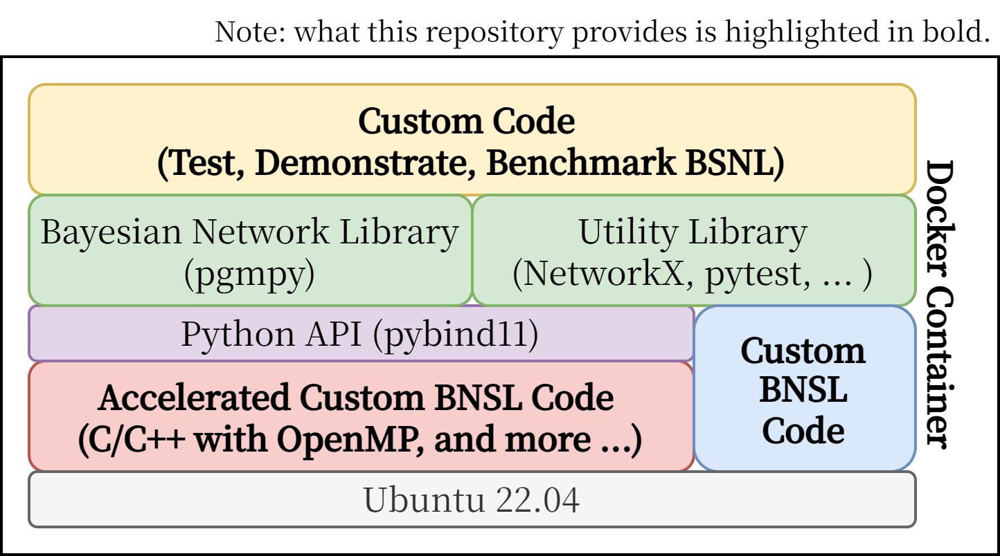

*Note: This repository is a mock-up, and the content within is currently under active development. Please be aware that functionalities and features are still being finalized.*

# OpenBNSL: Open BNSL Framework
Bayesian Network Structure Learning (BNSL) is the task of learning the graph structure of a Bayesian Network from data.
<!-- It is widely recognized as a challenging problem due to its computational complexity, and the difficulties associated with handling high-dimensional data.
To address these challenges, various methods have been proposed.

OpenBNSL is a unified, open-source, and comprehensive framework for evaluating BNSL methods.
Researchers can leverage this framework to demonstrate the advantages of their algorithms, while general users can utilize BNSL techniques without requiring specialized expertise.

To fulfill its purpose, the framework is designed with the following requirements in mind:
1. Performance: The provided algorithms should be fast enough for effective benchmarking.
2. Scalability: The framework should handle large datasets and a significant number of random variables (e.g., over 1,000 variables), except where limited by algorithmic constraints.
3. Reproducibility: The framework should facilitate the easy reproduction of experiments.

To meet these requirements, OpenBNSL is designed as follows:
1. Backend: Written in C/C++ with OpenMP for high performance and scalability, with plans for further acceleration in the future.
2. Frontend: Implemented in Python to provide a user-friendly interface and leverage powerful libraries for:
    - Data manipulation (`Pandas`)
    - Visualization (`Matplotlib`, `NetworkX`)
    - Interactive prototyping (`Jupyter Notebook`)
    - Documentation (`Sphinx`, `breathe`)
    - Utilizing learned models (`pgmpy`). (including exporting the learned model to `pgmpy`).
3. Integration: The backend and frontend are connected using pybind11, enabling seamless and high-performance communication between Python and C++.
4. Containerization: The project is containerized using Docker, ensuring a reproducible environment, objective benchmarking, and ease of contribution from the community.

This framework is offered as an open-source project, and we actively welcome contributions from the community. We hope OpenBNSL becomes a valuable tool for researchers and practitioners working in the field of Bayesian Networks.

Note: When cloning this repository, please make sure to clone the repository with `--recurse-submodules` to include the pybind11 submodule.

<div style="display: flex; align-items: center; gap: 10px;">
  
  
</div>

## Features
- Structure Learning from data
    - [ ] Hill Climbing
    - [ ] Tabu Search
    - [ ] Simulated Annealing 
    - [ ] Integer Programming (IP)
    - [ ] Greedy Equivalent Search (GES)
    - [ ] Peter-Clark algorithm (PC)
    - [ ] Min-Max Hill Climbing (MMHC)
    - [ ] Recursive Autonomy Identification (RAI)
- Evaluation Metrics
    - Structural Likelihood
        - [ ] Akaike Information Criterion (AIC)
        - [ ] Bayesian Information Criterion (BIC)
        - [ ] Minimum Description Length (MDL)
        - [ ] Bayesian Dirichlet equivalent uniform (BDeu) 
    - [ ] Structural Hamming Distance
    - [ ] Inference Accuracy
- Benchmarking  -->

## Table of Contents
- [Installation](#installation)
- [Planed Features](#planed-features)
- [Set Up Docker Environment (Recommended)](#set-up-docker-environment)
- [Set Up Bare Metal Environment (Not Recommended)](#set-up-bare-metal-environment)
- [Build the project](#build-the-project)
- [Run Tests](#run-tests)
- [Examples](#examples)
- [Contributing](#contributing)
- [License](#license)

    
## Set Up
```bash
docker compose build
docker compose up
```

### Optional: Nvidia GPU Support
If you have an Nvidia GPU, you can use the following command to build the image with GPU support.
```bash
docker compose build --build-arg BASE_IMAGE=nvidia/cuda:12.6.2-devel-ubuntu22.04
```

### Optional: Gurobi License
If you want to use gurobi, you need to get a license file (gurobi.lic) and put it in the same directory as the Dockerfile.
Gurobi provides free licenses for academic use.
```bash
docker compose build --build-arg INSTALL_GUROBI=true
```

## Build and Install
```bash
pip install . # install the package
python3 setup.py build_ext --inplace # build the backend
```

## Scripts
```bash
pytest # run the frontend test
./build_test.sh # build the backend test
./run_test.sh # run the backend test
./format.sh # format the code
./gen_docs.sh # generate the documentation
```

## Tutorial and Examples
TBD

## Contributing
Please feel free to create a new issue for any bugs, questions etc. 
If you want to contribute code, please follow the instructions in [Contributing](CONTRIBUTING.md)

## License
This project is licensed under the MIT License - see the [LICENSE](LICENSE) file for details.

## Acknowledgments
This work was supported by
JSPS KAKENHI, Grant Number 24KJ0578,
JST CREST, Grant Number JPMJCR21D2, and
JST SPRING, Grant Number JPMJSP2108.