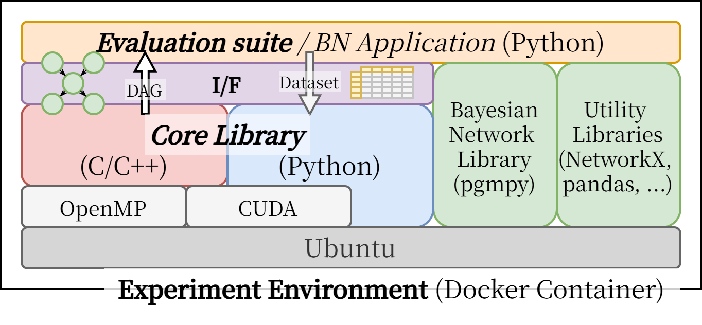

Note: This repository is currently under active development. Please be aware that functionalities and features are still being finalized.

OpenBNSL is an open framework designed to enable fair and highly reproducible comparisons of Bayesian Network Structure Learning (BNSL) algorithms.
A Bayesian network is a powerful probabilistic model that represents conditional independence relationships among variables using directed acyclic graphs (DAGs).
Learning the structure of a large Bayesian Network from data is computationally intensive, and optimization techniques, including parallelization, can significantly improve performance.

This framework provides an environment for systematically and fairly comparing various BNSL techniques, supporting the further advancement of Bayesian Network research.

| Component                       | Description                                                 |
|---------------------------------|-------------------------------------------------------------|
| OpenBNSL Core Library           | C++ library for BNSL methods with OpenMP and CUDA support   |
| OpenBNSL Evaluation Suite       | Python scripts for evaluating the OpenBNSL core library     |
| OpenBNSL Experiment Environment | Docker-based environment for reproducible experiments       |



OpenBNSL ensures transparency by adopting the MIT License and maintaining a strong commitment to the Open Science principle.

1. [Set Up](#set-up)
    1. [Using Docker](#using-docker)
        1. [Optional: Nvidia GPU Support](#optional-nvidia-gpu-support)
        2. [Optional: Gurobi License](#optional-gurobi-license)
    2. [Local Installation](#local-installation)
2. [Build and Install](#build-and-install)
3. [Features](#features)
4. [Tutorial and Examples](#tutorial-and-examples)
5. [Contributing](#contributing)
6. [License](#license)
7. [Acknowledgments](#acknowledgments)


---
# Set Up

## (Recommended) Using Docker
```bash
git clone --recurse-submodules git@github.com:hal-lab-u-tokyo/OpenBNSL.git # for pybind11 submodule
cd OpenBNSL
docker compose build
docker compose up
```

### Optional: Nvidia GPU Support
If you have an Nvidia GPU, you can use the following command to build the image with GPU support.
```bash
docker compose build --build-arg BASE_IMAGE=nvidia/cuda:12.6.2-devel-ubuntu22.04
```

### Optional: R and `bnlearn` Support 
If you want to use R and `bnlearn`, you can use the following command to build the image with R and `bnlearn` support.
```bash
docker compose build --build-arg INSTALL_R=true
```

### Optional: Gurobi Support
If you want to use gurobi, you need to get a license file (gurobi.lic) and put it in the same directory as the Dockerfile.
Gurobi provides free licenses for academic use.
```bash
docker compose build --build-arg INSTALL_GUROBI=true
```

## (Not Recommended) Using Bare Metal
⚠️ Under construction ⚠️


---
# Build and Install
```bash
pip install . # build and install the package
python3 setup.py build_ext --inplace # build in place
```

---
# Features Tracker
- Core Library (C++)
    - Score-based Structure Learning
        - [x] Exhaustive Search
    - Constraint-based Structure Learning
        - [x] Peter-Clark algorithm (PC) 
        - [x] Recursive Autonomy Identification (RAI) [[paper]](https://dl.acm.org/doi/10.5555/1577069.1755836)
    - local-to-global learning
        - [ ] 
- Evaluation Suite (Python)
    - Evaluation Metrics
        - [x] Structural Hamming Distance
        - [ ] Marginal Likelihood
            - [x] Bayesian Dirichlet equivalent uniform (BDeu) score
        - [ ] Inference accuracy
        - [ ] memory usage
        - [ ] runtime
    - Benchmarking Senarios
        - [ ] scalability for number of variables
        - [ ] scalability for number of samples
    - [ ] Generate Synthetic Data
- Experiment Environment (Docker)
    - [x] OpenMP support (default)
    - [x] Nvidia GPU and CUDA toolkit support
    - [x] R and `bnlearn` support
    - [x] Gurobi support
    - [ ] MPI?

⚠️ Under construction ⚠️


--- 
# Tutorial and Examples
⚠️ Under construction ⚠️


--- 
# Contributing
Please feel free to create a new issue for any bugs, questions etc. 
If you want to contribute code, please follow the instructions in [CONTRIBUTING](CONTRIBUTING.md)

--- 
# License
This project is licensed under the MIT License - see the [LICENSE](LICENSE) file for details.

---
# Acknowledgments
This work was supported by
JSPS KAKENHI, Grant Number 24KJ0578,
JST CREST, Grant Number JPMJCR21D2, and
JST SPRING, Grant Number JPMJSP2108.