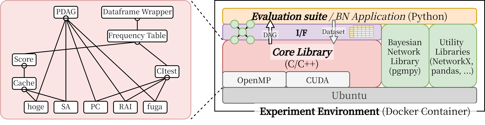

# OpenBNSL

OpenBNSL is a unified framework for fair, reproducible, and transparent comparison of Bayesian Network Structure Learning (BNSL) algorithms.

| Component                  | Description                                               |
|----------------------------|-----------------------------------------------------------|
| **Core Library**           | BNSL algorithms in C/C++ with OpenMP and CUDA             |
| **Evaluation Suite**       | Evaluation modules and Benchmark scripts in Python        |
| **Experiment Environment** | Docker-based environment for reproducible experiments     |



1. [Setup](#setup)
2. [Build and Install](#build-and-install)
3. [Features](#features)
4. [Contributing](#contributing)
5. [License](#license)
6. [Acknowledgments](#acknowledgments)

---
# Setup

We **strongly recommend** using the Docker environment. 

```bash
git clone --recurse-submodules git@github.com:hal-lab-u-tokyo/OpenBNSL.git # for pybind11 submodule
cd OpenBNSL

docker compose build \
  [--build-arg BASE_IMAGE=nvidia/cuda:12.6.2-devel-ubuntu22.04] \  # optional: Nvidia GPU support

docker compose up
```

<!-- For Future Use (R, bnlearn, Gurobi) -->
<!-- 
```bash
git clone --recurse-submodules git@github.com:hal-lab-u-tokyo/OpenBNSL.git # for pybind11 submodule
cd OpenBNSL
docker compose build \
  [--build-arg BASE_IMAGE=nvidia/cuda:12.6.2-devel-ubuntu22.04] \  # optional: Nvidia GPU support
  [--build-arg INSTALL_R=true] \                                   # R & bnlearn
  [--build-arg INSTALL_GUROBI=true]                                # Gurobi (requires license)
docker compose up
``` 
-->

---
# Build and Install

```bash
# Inside the Docker container
pip install . # builds the C++ core + installs Python bindings
OPENBNSL_DEBUG=ON pip install . # enable debug logs
```

# Example Notebooks
See the examples in the [examples](examples/) directory:

# Benchmarks
See the benchmarks in the [benchmarks/](benchmarks/) directory.

Illustrative example [`benchmarks/scenarios/benchmark_pc.py`](benchmarks/scenarios/benchmark_pc.py):
```bash
# Run example benchmark (PC vs. pgmpy-PC)
root@container:/workspace# pytest -s benchmarks/scenarios/benchmark_pc.py

=================================================================== test session starts ===================================================================
platform linux -- Python 3.10.12, pytest-8.3.3
collected 40 items

[...]

--- Summary for benchmark_pc ---
model_name  num_vars  num_samples citest             algo  num_threads  count  shd_mean  shd_std  original_score_mean  learned_score_mean  score_ratio_mean  time_mean_s  time_std_s
     alarm        37       200000   chi2 pc_edge_parallel          128      5      3.80     4.02          -2089569.51         -1995558.15              0.96         1.13        0.07
     alarm        37       200000   chi2         pc_pgmpy          128      5      4.40     3.13          -2089569.51         -1993880.95              0.95        67.52        2.22
     child        20       200000   chi2 pc_edge_parallel          128      5      0.40     0.89          -2441167.36         -2136790.53              0.88         1.43        0.07
     child        20       200000   chi2         pc_pgmpy          128      5      0.00     0.00          -2441167.36         -2136840.17              0.88        63.23        3.81
 insurance        27       200000   chi2 pc_edge_parallel          128      5     17.40     5.68          -2616514.00         -2624224.05              1.00         3.30        0.14
 insurance        27       200000   chi2         pc_pgmpy          128      5     26.80     3.83          -2616514.00         -2681482.42              1.02       166.16        6.67
     water        32       200000   chi2 pc_edge_parallel          128      5     34.80     1.48          -2557434.16         -2407465.94              0.94         1.18        0.04
     water        32       200000   chi2         pc_pgmpy          128      5     43.20     3.27          -2557434.16         -2410543.49              0.94        57.58        2.03


===================================================================================================================================== 40 passed in 1915.17s (0:31:55) ======================================================================================================================================
```


---
# Key Features
- Core Library (C/C++ with OpenMP & optional CUDA)
    - Score-based Structure Learning
        - [x] Exhaustive Search with Dynamic Programming
        - [x] Simulated Annealing on Parent-Set Space
    - Constraint-based Structure Learning
        - [x] Peter-Clark (PC) with edge-parallel CI tests 
        - [x] Recursive Autonomy Identification (RAI) with edge-parallel CI tests
        - [ ] Peter-Clark (PC) using GPU
    - local-to-global learning
        - [ ] 
- Evaluation Suite (Python)
    - Evaluation Metrics
        - [x] Structural Hamming Distance (SHD)
        - [x] Marginal Likelihood (ML)
        - [ ] Inference accuracy
    - Benchmarking Scenarios
        - [x] PC vs. RAI  [`benchmarks/scenarios/benchmark_pc_and_rai.py`](benchmarks/scenarios/benchmark_pc_and_rai.py)
        - [x] OpenBNSL PC vs. pgmpy PC  [`benchmarks/scenarios/benchmark_pc.py`](benchmarks/scenarios/benchmark_pc.py)
    - Examples
        - [x] Run PC Algorithm and Visualize the Learned Structure [`examples/run_pc.ipynb`](examples/run_pc.ipynb)
        - [ ] scalability for number of samples
- Experiment Environment (Docker)
    - [x] OpenMP support (default)
    - [x] Nvidia GPU and CUDA toolkit support
    - [ ] Gurobi support
    - [ ] R and `bnlearn` support

--- 
# Documentation
More details can be found in the [https://hal.ipc.i.u-tokyo.ac.jp/OpenBNSL/](https://hal.ipc.i.u-tokyo.ac.jp/OpenBNSL/)

--- 
# Contributing
We welcome issues and pull requests!
Please see the guidelines in [CONTRIBUTING](CONTRIBUTING.md) for more details.

--- 
# License
This project is licensed under the MIT License - see the [LICENSE](LICENSE) file for details.

<!-- 
---
# References
If you use OpenBNSL in your research, please cite the following paper:

```bibtex

``` 
-->

---
# Acknowledgments
This work was supported by 
JSPS KAKENHI JP24KJ0578, 
JST CREST JPMJCR21D2, and 
JST SPRING JPMJSP2108, 
Japan.